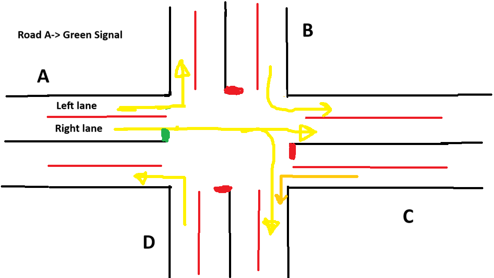
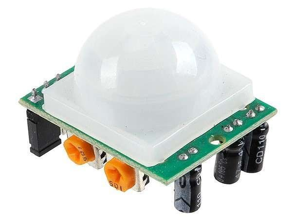
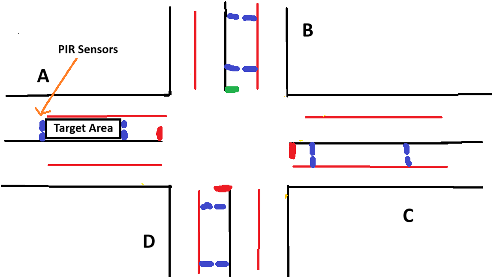
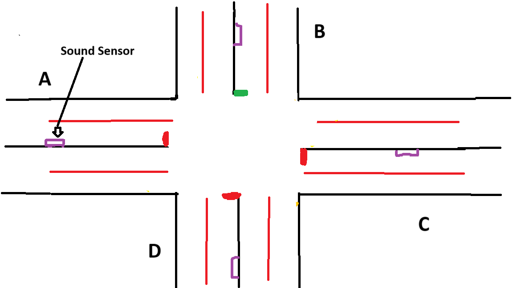
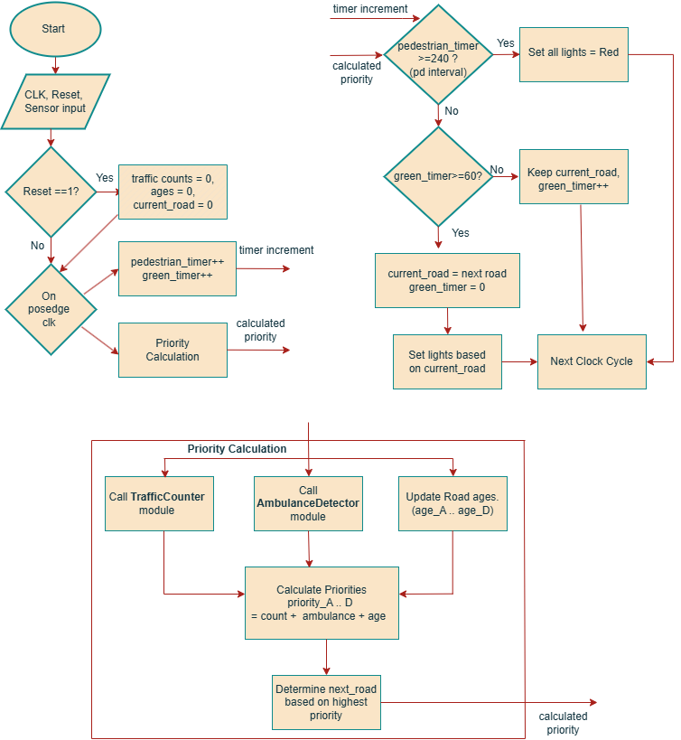

# 🚦 Traffic Control System using Verilog HDL

An intelligent traffic control system designed and implemented using **Verilog HDL**. This project simulates real-time decision-making using motion (PIR) and sound sensors to manage traffic efficiently at a junction.

---

## 📌 Project Overview

This project aims to demonstrate an optimized traffic signal control system at a 4-way junction. The control logic is written in **Verilog** and designed for synthesis on FPGA or ASIC platforms. The system uses:

- **PIR (motion) sensors** to detect vehicle presence
- **Sound sensors** to detect emergency vehicles (like ambulances)
- A **priority-based state machine** to control the traffic lights dynamically

---

## 🛠 Technologies Used

- **Verilog HDL**
- **OpenLane** (for RTL-to-GDS synthesis)
- **GTKWave** (for simulation and timing diagrams)
- **ModelSim/iverilog** (for testing and simulation)

---

## 🧠 System Structure

<table>
  <tr>
    <td align="center">
      <b>Junction Layout - View 1</b> 
      
    </td>
    <td align="center">
      <b>Junction Layout - View 2</b> 
      
    </td>
  </tr>
  <tr>
    <td align="center">
      <b>PIR Sensor</b> 
      
    </td>
    <td align="center">
      <b>PIR Sensor Setup</b> 
      
    </td>
  </tr>
  <tr>
    <td align="center" colspan="2">
      <b>Sound Sensor Setup</b> 
      
    </td>
  </tr>
</table>

---

## 🔁 System Flowchart

The flowchart below describes the logic of how the system transitions based on sensor input:

---

## 🧪 Simulation & Timing

Timing analysis and waveform diagrams were generated to verify system behavior using simulation tools.

🔗 **View here**:
- [⏱️ Timing Diagrams Folder](timing_diagram/)
- [📊 Synthesis Results Folder](synthesis_result/)

---

## 🧬 Synthesis

- ✅ **RTL-to-GDS synthesis completed using [OpenLane](https://github.com/The-OpenROAD-Project/OpenLane)**
- Targeted for ASIC-level design.
- Functional simulation verified before synthesis.

---

## 📄 License

This project is for academic and learning purposes only.  
Feel free to explore and modify it with proper credit.

---

## 🙋‍♂️ Author
Md. Rasel Rahman  
Graduate, Department of Computer Science & Engineering – RUET

---

Let me know if you’d like to include Makefile support, FPGA test photos, or simulation instructions.
